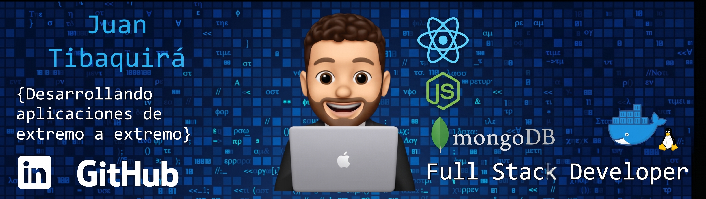

<h1>
  Hi, I'm Juan Camilo! 
  
</h1>

  

<h3>Backend-Focused Software Engineer</h3>

  Engineering professional transitioning into software engineering, with 5+ years
  of professional experience working in technical and data-intensive environments.

  Currently focused on building backend and full-stack applications while
  strengthening my skills in TypeScript, Node.js, PostgreSQL, APIs, Docker, and Linux.

<h3>👨‍💻 About Me</h3>

  My background in Geological Engineering and data-intensive technical environments
  has given me a strong foundation in analytical thinking, structured problem solving,
  and working with complex technical information.

  I am now focusing my career on software engineering, with particular interest in
  backend development, APIs, databases, containerization, and modern development workflows.

<ul>
  <li>🌱 Currently strengthening my skills in TypeScript, Node.js, PostgreSQL, REST APIs, Docker, and backend architecture.</li>
  <li>🔧 Building practical projects to develop stronger software engineering and backend skills.</li>
  <li>🤖 Using AI-assisted development tools such as Claude Code as part of my development workflow.</li>
  <li>📊 Bringing previous experience in Python, SQL, ETL, Power BI, GIS, and data analysis.</li>
</ul>

<h3>🛠️ Technologies & Tools</h3>

<h4>Backend & Programming</h4>

  
  
  
  

<h4>Database & Infrastructure</h4>

  
  
  
  
  

<h4>Development Tools</h4>

  
  
  

<h4>Previous Data & Analytics Experience</h4>

  
  
  
  

<h3>🚀 Featured Project</h3>

<h4>FullTiBaStack</h4>

  Full-stack web application developed step by step as part of structured
  full-stack training.

  The project provided hands-on experience with Node.js, Express.js, Docker,
  Linux/WSL, Nginx, Git/GitHub, and deployment to a DigitalOcean server.

  

<h3>📊 Previous Technical Background</h3>

  Before focusing on software engineering, I worked with technical and
  data-intensive engineering workflows involving:

<ul>
  <li>Python and SQL</li>
  <li>ETL and data processing</li>
  <li>Power BI and data visualization</li>
  <li>GIS and technical data management</li>
  <li>Engineering analysis and technical reporting</li>
</ul>

<h3>🤖 AI-Assisted Development</h3>

  I use AI-assisted development tools such as Claude Code to support research,
  coding, debugging, and development workflows, while focusing on understanding,
  testing, reviewing, and validating the code I build.

<h3>🤝 Let's Connect</h3>

  
  

## ⚡ Recent Activity

<!--START_SECTION:activity-->
<!--END_SECTION:activity-->

  Open to opportunities in backend and software engineering.

  <em>Thanks for visiting my profile!</em>

  © 2026 jctibaquiram

